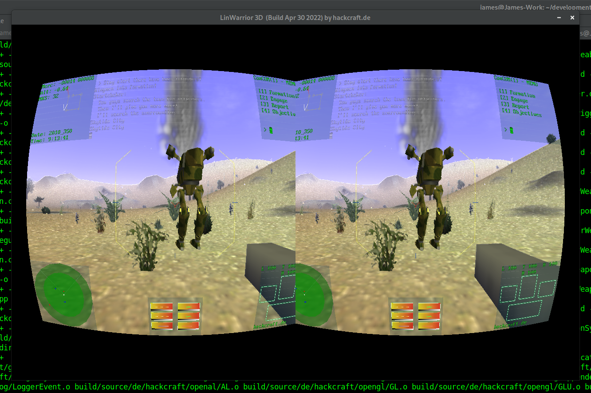

# Linwarrior3D
Linwarrior - Linux Mechwarrior Clone.

A clone of the famous Mechwarrior games on PC Windows, focused on Linux/Open Source Platforms.

Status:
- Compilation is working on Debian Linux Bookworm.
- Have not tested compilation on Windows or OSX.

Build Instructions:
- Checkout the repository and type "make clean all" requires ALut and OpenGL Libraries.

Adding New Mechs:
- Blender Plugin has been added to the repository under tools. Can Import/Export existing player models and edit/update them.
- Further instructions to come.

Roadmap: 
- Upgrading art using Blender/Gimp.
- Trying to remove hard coding from the engine where possible.
- Looking to build a menu and level system.
- Would eventually like to make a Mechwarrior campaign.

Screenshot:

